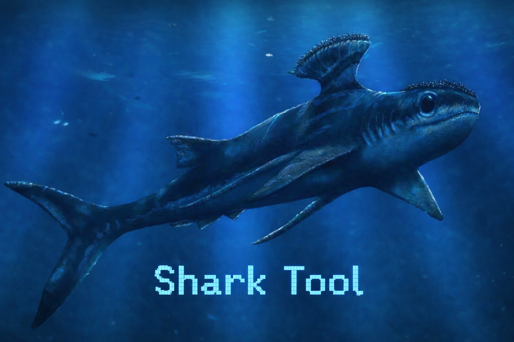

<p align="center">
    
</p>

### A Command-Line Power Utility by **Fossil Logic**

Shark Tool is the ultimate **all-in-one file and system administration utility** for admins, developers, and power users. It consolidates essential file management, automation, and analysis into a single command-line interface—eliminating tool fragmentation. Unique commands like `grammar` for text analysis, `introspect` for file inspection, and `cryptic` for encoding/decoding provide capabilities rarely found in traditional utilities, delivering the precision and flexibility professionals demand.

---

## Features

- **Comprehensive file and directory operations** — `show`, `copy`, `move`, `delete`, `rename`, `create`, and more
- **Archive management** — Create, extract, and list archives (zip, tar, gz) with encryption support
- **Advanced search capabilities** — Recursive file search by name or content with intelligent filtering
- **Metadata and timestamp control** — Smart handling of file permissions, timestamps, and attributes
- **Cross-platform support** — Seamless operation on Linux, macOS, and Windows
- **AI-powered analysis** — Grammar checking, tone detection, and text improvement via SOAP API
- **File synchronization** — Intelligent sync and backup with selective updates and deletion options
- **Real-time monitoring** — Watch files and directories for changes with event filtering
- **Text encoding/decoding** — Multiple cipher support (Caesar, Vigenere, Base64, etc.)
- **File comparison and inspection** — Diff analysis, introspection, and structured summaries


## **Why Choose Shark Tool?**

Unlike traditional CLI utilities that require juggling multiple tools, Spino consolidates essential file and system operations into a single, intuitive command-line interface. Here's what sets it apart:

- **All-in-One Solution**: Eliminate tool switching. File management, archiving, searching, synchronization, and analysis all in one place.
- **Unique Advanced Features**: Commands like `grammar` for intelligent text analysis, `summary` for structured insights, and `introspect` for deep file inspection go beyond standard utilities.
- **Developer-Friendly**: Built specifically for admins and developers who need power and flexibility without complexity.
- **Cross-Platform**: Works seamlessly across Linux, macOS, and Windows.
- **Intelligent Defaults**: Smart handling of timestamps, metadata, and file permissions with optional fine-grained control.
- **Modern Architecture**: Built with Meson and designed for performance and extensibility.

Spino Tool is the unified solution for professionals who demand more from their command-line utilities.

---

## **Prerequisites**

Ensure you have the following installed before starting:

- **Meson Build System**: This project relies on Meson. For installation instructions, visit the official [Meson website](https://mesonbuild.com/Getting-meson.html).

## **Setting Up Meson Build**

1. **Install Meson**:
    - Follow the installation guide on the [Meson website](https://mesonbuild.com/Getting-meson.html) for your operating system.

## **Setting Up, Compiling, Installing, and Running the Project**

1. **Clone the Repository**:

    ```sh
    git clone https://github.com/fossillogic/shark.git
    cd shark
    ```

2. **Configure the Build**:

    ```sh
    meson setup builddir
    ```

3. **Compile the Project**:

    ```sh
    meson compile -C builddir
    ```

4. **Install the Project**:

    ```sh
    meson install -C builddir
    ```

5. **Run the Project**:

    ```sh
    shark --help
    ```

## Command Palette

---

### Core File Operations

| **Command** | **Description** | **Flags** |
|-------------|-----------------|-----------|
| `show` | Display files and directories. | `-a`, `--all` (show hidden)<br>`-l`, `--long` (detailed info)<br>`-h`, `--human` (human-readable sizes)<br>`-r`, `--recursive` (include subdirs)<br>`-d`, `--depth <n>` (limit recursion)<br>`--as <mode>` (format: list/tree/graph)<br>`--time` (show timestamps)<br>`-s`, `--sort <key>` (sort by: asc/desc)<br>`-m`, `--match <pattern>` (filter by name)<br>`--size <filter>` (filter by size: e.g., >1MB)<br>`-t`, `--type <filter>` (filter by type: file/dir/link) |
| `merge` | Combine multiple files or directories. | `-f`, `--force` (overwrite)<br>`-i`, `--interactive` (confirm before merge)<br>`-b`, `--backup` (backup before merge)<br>`--strategy <mode>` (merge strategy: overwrite/keep-both/skip)<br>`--progress` (show progress)<br>`--dry-run` (preview merge)<br>`--exclude <pattern>` (exclude files)<br>`--include <pattern>` (include files) |
| `swap` | Exchange the locations of two files or directories. | `-f`, `--force` (overwrite if needed)<br>`-i`, `--interactive` (confirm swap)<br>`-b`, `--backup` (create backups before swap)<br>`--atomic` (guarantee atomic swap if supported)<br>`--progress` (show progress)<br>`--dry-run` (preview swap)<br>`--temp <path>` (temporary staging location)<br>`--no-cross-device` (fail if paths are on different filesystems) |
| `move` | Move or rename files/directories. | `-f`, `--force` (overwrite)<br>`-i`, `--interactive` (confirm overwrite)<br>`-b`, `--backup` (backup before move)<br>`--atomic` (atomic operation)<br>`--progress` (show progress)<br>`--dry-run` (preview changes)<br>`--exclude <pattern>` (exclude files)<br>`--include <pattern>` (include files) |
| `copy` | Copy files or directories. | `-r`, `--recursive` (copy subdirs)<br>`-u`, `--update` (only newer)<br>`-p`, `--preserve` (keep permissions/timestamps)<br>`--checksum` (verify after copy)<br>`--sparse` (preserve sparse files)<br>`--link` (hardlink instead)<br>`--reflink` (copy-on-write)<br>`--progress` (show progress)<br>`--dry-run` (simulate)<br>`--exclude <pat>` (exclude files)<br>`--include <pat>` (include files) |
| `remove` / `delete` | Delete files or directories. | `-r`, `--recursive` (delete contents)<br>`-f`, `--force` (no confirmation)<br>`-i`, `--interactive` (confirm per file)<br>`--trash` (move to trash)<br>`--wipe` (secure overwrite before delete)<br>`--shred <passes>` (multi-pass secure deletion)<br>`--older-than <time>` (delete files older than)<br>`--larger-than <size>` (delete files larger than)<br>`--empty` (delete only empty dirs)<br>`--log <file>` (write deletion log) |
| `rename` | Rename files or directories. | `-f`, `--force` (overwrite target)<br>`-i`, `--interactive` (confirm overwrite) |
| `create` | Create new directories or files. | `-p`, `--parents` (create parent dirs)<br>`-t`, `--type <type>` (file or dir) |
| `search` | Find files by name or content. | `-r`, `--recursive` (include subdirs)<br>`-n`, `--name <pattern>` (filename match)<br>`-c`, `--content <pattern>` (search contents)<br>`-i`, `--ignore-case` (case-insensitive)<br>`-p`, `--path <path>` (search within specific path) |
| `archive` | Create, extract, or list archives. | `-c`, `--create` (new archive)<br>`-x`, `--extract` (extract)<br>`-l`, `--list` (list archive)<br>`-f <format>` (zip/tar/gz)<br>`-p`, `--password <pw>` (encrypt)<br>`--stdout` (output to stdout) |
| `compare` | Compare two files/directories. | `-t`, `--text` (line diff)<br>`-b`, `--binary` (binary diff)<br>`--context <n>` (context lines)<br>`--ignore-case` (ignore case) |
| `help` | Display help for commands. | `--examples` (usage examples)<br>`--man` (full manual) |
| `sync` | Synchronize files/directories. | `-r`, `--recursive` (include subdirs)<br>`-u`, `--update` (only newer)<br>`--delete` (remove extraneous files) |
| `watch` | Monitor files or directories. | `-r`, `--recursive` (include subdirs)<br>`-e`, `--events <list>` (event filter)<br>`-t`, `--interval <n>` (poll interval) |
| `rewrite` | Modify file contents or metadata. | `-a`, `--append` (append)<br>`--in-place` (edit in place)<br>`--access-time` (update atime)<br>`--mod-time` (update mtime)<br>`--size <n>` (set file size) |
| `introspect` | Examine file contents/type/meta. | `--head <n>` (first n lines)<br>`--tail <n>` (last n lines)<br>`--count` (lines, words, bytes)<br>`--line` (total lines only)<br>`--size` (file size in bytes and human-readable)<br>`--time` (timestamps: modified, created, accessed)<br>`--type` (detect and display file type)<br>`--find <pattern>` (search for string or pattern)<br>`--media` (media format output text/fson/json) |
| `grammar` | Analyze/correct grammar/style via SOAP API. | `--check` (analyze grammar & style)<br>`--correct` (apply grammar correction)<br>`--sanitize` (clean unsafe language)<br>`--suggest` (improvement suggestions)<br>`--summarize` (concise summary)<br>`--score` (readability/clarity/quality scores)<br>`--tone` (detect tone)<br>`--detect <type>` (detect traits: `conspiracy`, `spam`, `ragebait`, `clickbait`, `bot`, `marketing`, `technobabble`, `hype`, `political`, `offensive`, `misinfo`, `brain_rot`, `formal`, `casual`, `sarcasm`, `neutral`, `aggressive`, `emotional`, `passive`, `snowflake`, `redundant`, `poor_cohesion`, `repeated_words`)<br>`--reflow-width <n>` (reflow to width)<br>`--capitalize <mode>` (sentence-case or title-case)<br>`--format` (pretty-print with indentation)<br>`--declutter` (repair whitespace & word boundaries)<br>`--punctuate` (normalize punctuation) |
| `cryptic` | Encode or decode text using various ciphers. | `-e`, `--encode` (encode text)<br>`-d`, `--decode` (decode text)<br>`-c`, `--cipher <type>` (cipher: `caesar`, `vigenere`, `base64`, `base32`, `binary`, `morse`, `baconian`, `railfence`, `haxor`, `leet`, `rot13`, `atbash`) |
| `split` | Split files into smaller segments. | `-l`, `--lines <n>` (split by line count)<br>`-b`, `--bytes <n>` (split by byte size)<br>`-n`, `--number <n>` (number of segments)<br>`-p`, `--prefix <name>` (output prefix)<br>`-s`, `--suffix <n>` (suffix digits)<br>`--numeric-suffix` (use numeric suffix)<br>`-d`, `--delimiter <char>` (custom delimiter)<br>`--dry-run` (preview split) |
| `perm` | Adjust or view file/directory permissions. | `--user <name>` (user-specific)<br>`--group <name>` (group-specific)<br>`--file <path>` (target file/directory)<br>`--grant <perm>` (add permission)<br>`--revoke <perm>` (remove permission)<br>`--list` (show current permissions)<br>`--recursive` (apply to all nested files/dirs) |
| `pipe` | Chain commands, redirect outputs, or process streams. | `--input <file>` (source)<br>`--output <file>` (destination)<br>`--filter <cmd>` (inline filter)<br>`--tee` (split output to console and file)<br>`--media` (structured output)<br>`--append` (append to existing file) |
| `alias` | Create or manage command shortcuts. | `--set <name>=<cmd>` (define alias)<br>`--list` (show all aliases)<br>`--remove <name>` (delete alias)<br>`--global` (apply for all sessions) |
| `undo` | Revert previous file operations (move, copy, rename, remove). | `--last <n>` (revert last n operations)<br>`--file <path>` (specific target)<br>`--interactive` (confirm each undo)<br>`--dry-run` (preview undo) |
| `link` | Create hard or symbolic links between files or directories. | `--file <source>` (source file)<br>`--target <dest>` (destination path)<br>`--symbolic` (create symlink)<br>`--hard` (create hardlink)<br>`--relative` (use relative paths)<br>`--overwrite` (replace existing links) |
| `dedupe` | Detect and optionally remove duplicate files. | `--dir <path>` (target directory)<br>`--hash` (compare via file hash)<br>`--interactive` (confirm deletions)<br>`--delete` (remove duplicates)<br>`--link` (replace duplicates with links)<br>`--media` (media format output text/fson/json) |

---

### Global Flags

| **Flag** | **Description** |
|-----------|-----------------|
| `--help` | Show command help. |
| `--version` | Display app version. |
| `--verbose` | Enable detailed output. |
| `--color` | Colorize output where applicable. |
| `--clear` | Clear current output from terminal. |

---

### Usage Examples

| **Example** | **Description** |
|---|---|
| `shark show -a -l -h --as=tree --time` | List all files (including hidden) in long, human-readable format as a tree, with timestamps. |
| `shark merge -i -b src1/ src2/ dest/` | Interactively merge two source directories into destination with backups. |
| `shark swap -f -b file1.txt file2.txt` | Exchange the locations of two files, forcing the operation and creating backups. |
| `shark move -i -b old.txt archive/old.txt` | Move a file interactively, creating a backup before moving. |
| `shark copy -r -p src/ backup/` | Recursively copy with preserved permissions and timestamps. |
| `shark remove -r --trash temp/` | Recursively move directory to system trash. |
| `shark rename -i draft.md final.md` | Rename a file with confirmation before overwriting. |
| `shark create -p -t dir logs/archive/2024/` | Create nested directory structure. |
| `shark search -r -c "config"` | Recursively search for string "config" inside files. |
| `shark archive -c -f tar project.tar src/` | Create a TAR archive from the src/ directory. |
| `shark compare -t main_v1.c main_v2.c --context 5` | Show line-by-line diff with 5 lines of context. |
| `shark help --examples` | Display command help with usage examples. |
| `shark sync -ru src/ dest/` | Recursively synchronize, copying only newer files. |
| `shark watch -r -e create,delete src/` | Monitor src/ recursively for creation and deletion events. |
| `shark rewrite -a --in-place log.txt "New entry"` | Append new entry to log file in-place. |
| `shark introspect --head 20 --tail 5 --type data.csv` | Show first 20 and last 5 lines, detect file type. |
| `shark grammar --check --tone --score notes.txt` | Run grammar check, detect tone, display readability scores. |
| `shark cryptic -e -c caesar "hello"` | Encode text using Caesar cipher. |
| `shark split -l 100 -p chunk_ large_file.txt` | Split file into chunks of 100 lines with "chunk_" prefix. |


## Command Comparison (Shark vs Traditional Tools)

Shark Tool consolidates many common command-line utilities into a **single consistent interface**.  
Below is a comparison between **Shark commands** and their traditional equivalents.

| **Spino Command** | **Traditional Commands** | **Purpose** |
|---|---|---|
| `shark show` | `ls`, `tree`, `stat` | Display files, directories, metadata, and structures with filtering, sorting, and multiple output formats. |
| `shark merge` | `cp`, `rsync` (merge mode) | Combine multiple files or directories with conflict resolution strategies. |
| `shark swap` | `mv` (with custom logic) | Exchange the locations of two files or directories atomically with backups. |
| `shark move` | `mv` | Move or rename files/directories with atomic operations and filtering. |
| `shark copy` | `cp` | Copy files or directories with verification, copy-on-write, and hardlinking. |
| `shark remove` / `delete` | `rm`, `trash`, `shred` | Remove files with optional trash, secure multi-pass wipe, and filtering. |
| `shark rename` | `mv`, `rename` | Rename files with safer overwrite controls and batch operations. |
| `shark create` | `mkdir`, `touch` | Create directories or files with parent directory generation. |
| `shark search` | `find`, `grep`, `locate` | Search files by name, path, or contents with case-insensitive matching. |
| `shark archive` | `tar`, `zip`, `unzip`, `gzip` | Create, extract, or list archives with encryption and format support. |
| `shark compare` | `diff`, `cmp` | Compare text or binary files with context and case-insensitive options. |
| `shark help` | `man`, `--help` | Display command help and documentation with examples. |
| `shark sync` | `rsync` | Synchronize directories with update checking and selective deletion. |
| `shark watch` | `inotifywait`, `fswatch` | Monitor filesystem changes with event filtering and polling intervals. |
| `shark rewrite` | `sed`, `truncate`, `touch` | Modify file contents or metadata including timestamps and size. |
| `shark introspect` | `head`, `tail`, `wc`, `file`, `stat` | Inspect file contents, type, and metadata with structured output. |
| `shark grammar` | *(no direct CLI equivalent)* | AI-assisted grammar, style, and tone analysis with multiple detection traits. |
| `shark cryptic` | *(no direct CLI equivalent)* | Encode or decode text using classic and modern ciphers. |
| `shark split` | `split` | Split files into segments by lines, bytes, or count with custom naming. |

---

## **Contributing**

Interested in contributing? Please open pull requests or create issues on the [GitHub repository](https://github.com/fossillogic/shark).

## **Feedback and Support**

For issues, questions, or feedback, open an issue on the [GitHub repository](https://github.com/fossillogic/shark/issues).

## **License**

This project is licensed under the [Apache Public License](LICENSE).
